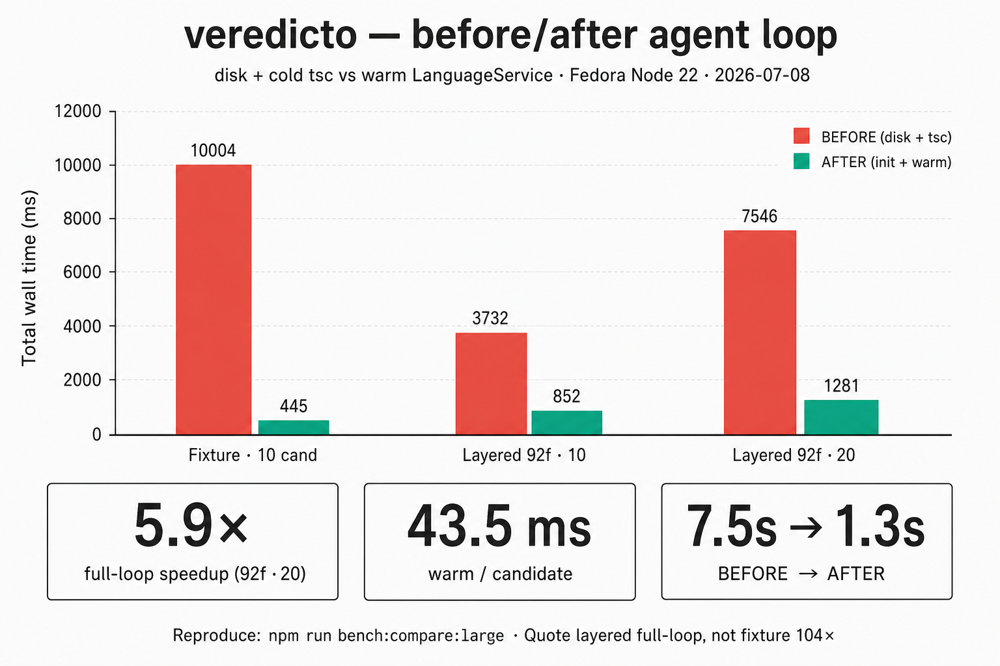

# veredicto

Verdicts, not prose. An agent-native TypeScript checker: batch-verify candidate patches against a live project session and get structured JSON back — new errors, fixed errors, repair actions — instead of error text written for a human squinting at a terminal.

## Why this exists

Every serious coding agent runs the same loop: write a patch, run the checker, parse prose-shaped errors, guess a fix, repeat. Two things are broken in that loop. The checker restarts from zero on every attempt, and its output format was designed for people, not programs.

The industry noticed in 2026. Vercel Labs shipped Zero in May — a brand-new systems language whose compiler emits structured JSON with stable error codes and typed repair IDs. Right interface, wrong side of the adoption valley: nobody's codebase is written in Zero. Researchers made the same point from the other end — compiler feedback quality is a fundamental bottleneck for coding agents (arXiv 2604.13927).

veredicto takes the agent-first interface to the language agents already write all day. Point it at your `tsconfig.json`, keep a warm session, and throw N candidate patches at it. Each candidate is judged against the project baseline: pass if it introduces no new errors, fail with structured diagnostics plus TypeScript's own code-fix suggestions mapped to precise, editable spans.

## What it does

- Holds one live TypeScript language service over your real project. Your `tsconfig.json` is respected, not approximated.
- Accepts candidates as in-memory file overlays: replace a file, add a new one, or delete one (`null`). Disk is never touched.
- Computes the delta against the baseline: `newErrors`, `fixedErrors`, `totalErrors`. Pre-existing debt does not fail your patch; only regressions do.
- Catches cross-file damage: patch `math.ts`, and the break it causes in `report.ts` shows up in the verdict.
- Returns TypeScript code fixes for new errors as structured repair actions (`file`, `position`, `length`, `newText`) with `confidence` and `preconditions`.
- Optional semantic impact: export signature delta + reference (def–use) fan-out via the checker (`impact: true` / `--impact`).
- Optional speculative parallel checks via `worker_threads` (`parallel: true` / `--parallel`) — one Session per worker.
- Speaks HTTP (`POST /v1/check`, `GET /v1/health`) and CLI, with agent-friendly exit codes: 0 all pass, 2 any fail, 1 usage or crash.
- Has a `--compact` mode when tokens are the budget. Formal schema: [docs/veredicto.schema.json](docs/veredicto.schema.json).

## Quickstart

```bash
npm install -g veredicto
# or: npx veredicto …

# daemon mode
veredicto serve --project path/to/tsconfig.json --port 4117
curl -s localhost:4117/v1/check -d '{
  "fixes": true,
  "candidates": [
    { "id": "patch-a", "files": { "src/report.ts": "import { add } from \"./math.js\";\n\nexport const total: number = add(1, 2);\n" } }
  ]
}'

# one-shot mode
veredicto check --project path/to/tsconfig.json --candidates candidates.json --compact

# agent-first extras
veredicto check --project path/to/tsconfig.json --candidates candidates.json --fixes --impact --parallel
```

From a clone, the same entry points are `npm run build` then `node dist/cli.js …`. Against the bundled fixture (`--project test/fixture/tsconfig.json`) you can watch `fixedErrors` move — the fixture ships with one deliberate baseline error.

## Verdict semantics

`pass` means the candidate introduces zero new errors relative to the baseline captured at session start. That is a deliberate choice: an agent fixing one function in a repo with 400 legacy errors should not drown in them, and it should not get credit for them either. `fixedErrors` tells you when a patch actually paid down debt. `totalErrors` never lies about the whole picture.

## Numbers

Before/after **agent loop** (write disk → spawn `tsc` → restore vs warm Session). Full tables: [docs/BENCH.md](docs/BENCH.md).



| project | candidates | BEFORE total | AFTER init+batch | full-loop | per-cand warm |
| --- | --- | --- | --- | --- | --- |
| Fixture (2 files) | 10 | ~10.0 s | ~0.45 s | **~22×** | **~104×** |
| Layered app (92 files) | 10 | ~3.7 s | ~0.85 s | **~4.4×** | **~8.2×** |
| Layered app (92 files) | 20 | ~7.5 s | ~1.3 s | **~5.9×** | **~8.7×** |

Quote the **layered full-loop** ratio (~5.9× on 20 candidates) for anything resembling a real project. Fixture 104× is real but toy-scale. Reproduce:

```bash
npm run bench:compare              # fixture before/after
npm run bench:compare:large        # layered ~92-file app
npm run bench -- --project path/to/tsconfig.json
```

## Limits (on purpose)

Candidates are full-file contents, not diffs. The delta is keyed by file + code + message, so two byte-identical errors in one file collapse into one. Impact is export-signature + references, not a full reaching-definitions solver. No auth — serve binds loopback only and refuses anything else. Parallel mode re-inits a Session per worker (correct isolation, higher init cost).

## Roadmap

Unified-diff input. Span-anchored deltas. Deeper data-flow impact. A tsgo backend when Microsoft's native port stabilizes. Same protocol over other checkers.

## Development

```bash
npm install
npm run build
npm test                   # build + node:test suite (core + HTTP)
npm run bench:compare      # before/after agent loop (fixture)
npm run bench:compare:large # before/after on layered ~92-file app
npm run bench              # micro: cold tsc vs warm overlay
npm run example:agent      # drop-in agent loop against the fixture
npm run lint          # Biome, every rule on, nursery included, must exit 0
npm run semgrep       # full open-registry stack, must exit 0
```

## Docs

| Doc | What |
| --- | --- |
| [PITCH.md](PITCH.md) | Full thesis — problem, insight, risks, ask |
| [ANNOUNCE.md](ANNOUNCE.md) | Short public announcement draft |
| [docs/ARCHITECTURE.md](docs/ARCHITECTURE.md) | Post-checker phases; what TS owns vs veredicto |
| [docs/PROTOCOL.md](docs/PROTOCOL.md) | Wire contract (HTTP + CLI + library) |
| [docs/veredicto.schema.json](docs/veredicto.schema.json) | Formal JSON Schema for CheckResponse |
| [docs/INTEGRATION.md](docs/INTEGRATION.md) | Agent / CI integration recipe |
| [docs/BENCH.md](docs/BENCH.md) | Measured numbers + how to reproduce |
| [GOAL.md](GOAL.md) | Scope and done-criteria |
| [DEBT.md](DEBT.md) | Open debt |

## Prior art

Vercel Labs' Zero (May 2026) proved agent-first compiler output — for a new language. Cursor's shadow workspace pioneered background language-server checks inside one editor. ai-typescript-check did single-snippet TwoSlash checks in the ChatGPT-plugin era. veredicto is the neutral, project-scale piece: any agent, over the TypeScript you already have.

## License

MIT.
