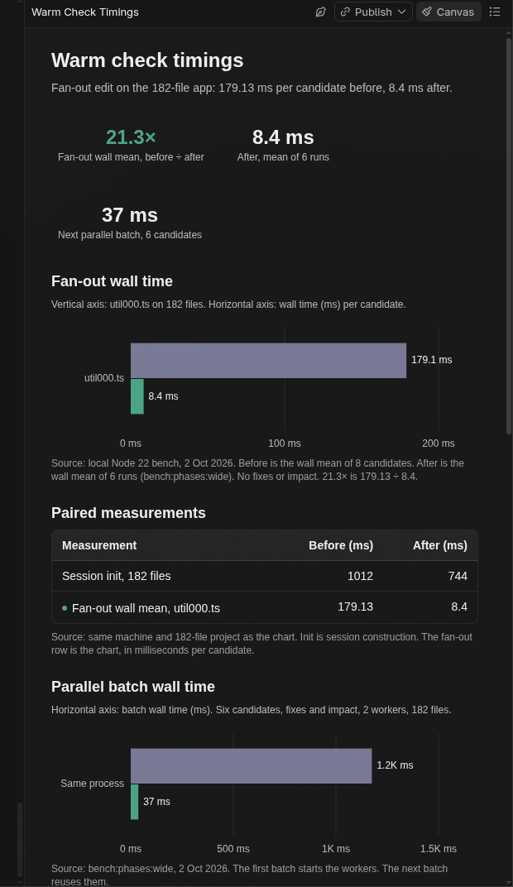

# Benchmarks

Measured on this machine (Fedora, Node 22) on 2026-07-08. Re-run before quoting.

## What is being compared

**BEFORE — legacy agent loop** (what agents do today):

```
for each candidate:
  write patched files to disk
  spawn `tsc --noEmit` (new Node process)
  restore disk
```

**AFTER — veredicto**:

```
Session init once (LanguageService + baseline)
for each candidate:
  apply in-memory overlays
  check (+ optional fixes/impact)
  restore overlays
```

Optional: `--parallel` / `workers` — one Session per worker (correct isolation). The first batch in a process pays init; later batches reuse the worker.

Candidates are not “append a comment”. They include a real baseline fix, a cross-file signature regression, and neutral edits — the shapes an agent actually emits.

## Reproduce

```bash
# Fixture (2 files), 10 candidates, before/after + parallel
npm run bench:compare

# Layered synthetic app (~92 files), 10 candidates
npm run bench:compare:large

# Larger batch on the layered project
npm run build && node bench/generate-large.mjs
node bench/compare.mjs --project bench/large/tsconfig.json --candidates 20 --skipParallel

# Micro-bench only (cold tsc vs warm overlay, no disk write loop)
npm run bench
npm run bench:large
```

## Measured — before/after agent loop

### Fixture (`test/fixture`, 2 root files, 1 baseline error, 10 candidates)

| path | total wall | per candidate |
| --- | --- | --- |
| BEFORE disk→`tsc`→restore | **10,004 ms** | **1,000 ms** avg |
| AFTER init once | 348 ms | — |
| AFTER warm batch (fixes+impact) | 97 ms | **9.6 ms** avg |
| AFTER init+batch | **445 ms** | — |
| AFTER parallel (2 workers) batch | 567 ms | 11.5 ms avg inside workers |

| ratio | value |
| --- | --- |
| per-candidate BEFORE / AFTER warm | **~104×** |
| full-loop BEFORE total / AFTER init+batch | **~22.5×** |

### Layered synthetic app (`bench/large`, 92 files, 1 baseline error)

Generated by `bench/generate-large.mjs`: 40 core + 30 services + 20 routes + `app.ts` + `report.ts`. Graph-shaped (routes → services → core), not a linear toy chain.

**10 candidates** (fix + signature break + neutrals):

| path | total wall | per candidate |
| --- | --- | --- |
| BEFORE disk→`tsc`→restore | **3,732 ms** | **373 ms** avg |
| AFTER init once | 401 ms | — |
| AFTER warm batch (fixes+impact) | 451 ms | **45.3 ms** avg |
| AFTER init+batch | **852 ms** | — |
| AFTER parallel (2 workers) batch | 841 ms | 50.3 ms avg inside workers |

| ratio | value |
| --- | --- |
| per-candidate BEFORE / AFTER warm | **~8.2×** |
| full-loop BEFORE total / AFTER init+batch | **~4.4×** |

**20 candidates** (same project, sequential only):

| path | total wall | per candidate |
| --- | --- | --- |
| BEFORE | **7,546 ms** | **377 ms** avg |
| AFTER init+batch | **1,281 ms** | **43.5 ms** avg |

| ratio | value |
| --- | --- |
| per-candidate | **~8.7×** |
| full-loop | **~5.9×** |

Cross-file signal on the layered project: `break-core-signature` failed with `newErrors=3` (fan-out from `util000` into dependents) — the warm path is checking real graph damage, not a no-op.

## How to read these numbers

1. **Full-loop ratio is the honest product metric.** Agents pay N cold `tsc` starts today; with veredicto they pay init once + N warm checks. On the 92-file app with 20 candidates that is ~5.9× wall-clock.
2. **Per-candidate warm ratio ignores init.** Useful for “how fast is attempt #2…#N”, not for “first request in a cold process”.
3. **Parallel is not free on the first batch.** Each worker constructs its own Session. Later batches in the same process reuse that Session. See the phase bench below.
4. **Page cache helps cold `tsc`.** Sequential BEFORE runs share a warm filesystem cache. A colder disk / CI container widens BEFORE times (historical fixture container: ~6.6 s cold `tsc`).
5. **Do not quote fixture 104× for a monorepo.** Quote the layered numbers or your own `--project` run.

## Micro-bench (historical / secondary)

`npm run bench` still measures cold `tsc` vs warm overlay without the disk write/restore loop. Useful for LanguageService incremental cost; less faithful to the agent loop than `bench:compare`.

| project | cold `tsc` / cand | init | warm / cand |
| --- | --- | --- | --- |
| Fixture (earlier this session) | ~1,018 ms | ~384 ms | ~8.5 ms |
| Old linear 200-module chain | ~424 ms | ~492 ms | ~110 ms |

## Phase bench (warm path only)

`npm run bench:phases` times init, a narrow edit, a fan-out edit, fixes+impact, and two parallel batches. It does not spawn cold `tsc`.

```bash
npm run bench:phases
npm run bench:phases:wide   # ~182-file layered app
```

Measured on this machine (Node 22) on 2026-10-02, 6 runs, fixes+impact on the narrow file for the parallel rows.



| project | files | init | narrow / cand | fan-out / cand | fixes+impact / cand | parallel cold batch | parallel warm batch |
| --- | --- | --- | --- | --- | --- | --- | --- |
| Fixture | 3 | 656 ms | 6.5 ms | 5.1 ms | 7.9 ms | 1,082 ms | 17 ms |
| Wide layered app | 182 | 744 ms | 12.4 ms | 8.4 ms | 13.6 ms | 1,175 ms | 37 ms |

Before this pass, the same 182-file app rechecked every file and took about **179 ms** per warm candidate. The warm path now rechecks the edited file and its importers, and keeps script snapshots. The first parallel batch still pays worker init; the second batch reuses the workers.

## What this does *not* measure

- Token savings from structured JSON vs scraping `tsc` prose
- Network RTT to `POST /v1/check` (loopback only; add your own if needed)
- Unified-diff apply cost
- A warm worker pool that survives process exit (workers live only as long as the process; `serve` keeps them)
